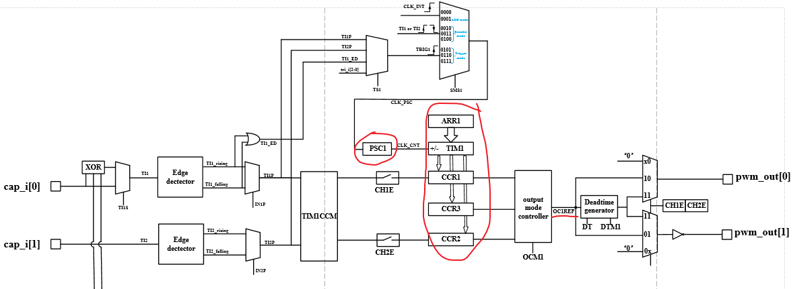

======
PWM
======

:link_to_translation:`en:[English]`

概述
======

bk7236 共有两组 PWM 控制器，PWM0 与 PWM1，每个PWM控制器下有3个TIM定时器，每个定时器有2个channel。

以 PWM0 来说，TIM 与 PWM channel 对应关系如下：

+------------+----------------+
| TIM Index  | Channel Index  |
+============+================+
|            | 0              |
| TIM1       +----------------+
|            | 1              |
+------------+----------------+
|            | 3              |
| TIM2       +----------------+
|            | 4              |
+------------+----------------+
|            | 5              |
| TIM3       +----------------+
|            | 6              |
+------------+----------------+

因此，每个 PWM 控制器有6个 channel，bk7236共支持12个 channel，对应软件中的 ``PWM_ID_0`` 到 ``PWM_ID_11``。

工作模式
===========

定时器可以工作在3种模式下：

 1. 独立输出模式
 2. 互补输出模式
 3. 输入捕获模式

功能框图
===========

----------
时钟源
----------

PWM 控制器 有两个时钟源可选：

 - clk_32K
 - XTAL

可通过 ``SYSTEM_REG0x8`` 配置。

-----------
PSC
-----------

预分频器，对输入时钟(clk_32K或XTAL)进行分频，输出CLK_CNT用来驱动计数器TIM计数。

PSC的设置可通过 ``PWM_REG_0xE`` 来配置，可实现1-256分频。

例如：

当我们时钟源选择XTAL=26MHz，配置PSC1=25时，计数器TIM1时钟则为1MHz，若计数器+1，则+1us。

--------
CCR
--------

当计数器CNT的值跟比较寄存器CCR的值相等时，输出参考信号OCxREF的信号的极性就会改变，并且会产生CCxI中断，相应的标志位CCxIF（REG_0x8寄存器中）会置位。
然后OCxREF再经过一系列的控制之后输出PWM信号。

BK7236 每个TIM 对应3个 ``CCR`` ，即在一个周期内，信号的极性可以翻转3次，其中

 - CCR1,CCR2,CCE3(REG_0x15-REG_0x17)对应TIM1
 - CCR4,CCR5,CCE6(REG_0x18-REG_0x1a)对应TIM2
 - CCR7,CCR8,CCE9(REG_0x1b-REG_0x1d)对应TIM3

当用作PWM输出模式时，输出方波信号的占空比由CCR决定。

.. note::

  CCRx 需设置大于1的值。

----------
ARR
----------

自动重载寄存器ARR用来存放与计数器CNT比较的值，可以理解为计数器计数的 end_value。

PWM输出方波信号的频率由ARR值决定。

--------------------------
Deadtime Generator
--------------------------

在生成的参考信号OCxREF的基础上，可以插入deadtime，用于生成两路互补的输出信号。

死区时间的大小具体由 ``REG_0x1E`` 的 DTx 配置。

PWM 输出模式
===============

---------------------
输出单路方波信号
---------------------

每组 PWM 的 相邻通道只能任选1路独立输出((0,1)相邻、(2,3)相邻、(4,5)相邻)，同时输出会相互干扰

示例： 输出5路 PWM 信号，频率为1KHz，占空比动态变化：从0%到100%，再从100%到0%。

具体示例代码详见 ``projects/example/peripherals/pwm/pwm_set_period_duty/main.c``

---------------------
输出互补带死区PWM
---------------------

关于互补输出，可分为硬件实现的互补模式与软件互补模式：

 - 硬件：每组 PWM 可实现3个互补输出，如概述中的表格所示，仅可配置 PWMx 的 CH0与CH1, CH2与CH3, CH4与CH5 作为互补输出，有相应的死区相关的寄存器可配置，较为精准，但通道固定
 - 软件：使用 PWM1 的 CH0, CH2, CH4 与 PWM2 的 CH0, CH2, CH4 任意两通道组成互补输出，软件实现互补功能，较为灵活，但精度不及硬件实现的方式

示例： CH0 与 CH4 输出不带死区的互补波形；CH6 与 CH8 输出带死区的互补波形。

具体示例代码详见 ``projects/example/peripherals/pwm/complementary_outputs/main.c``

