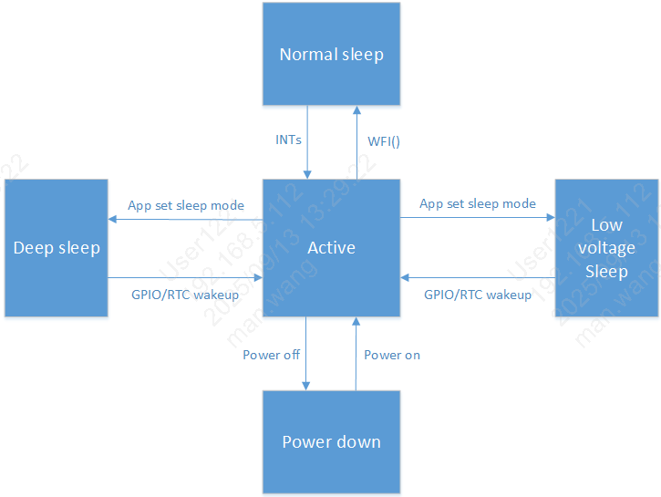

系统状态机说明
=============================================

:link_to_translation:`en:[English]`

系统支持不同的睡眠模式:
 - active
 - normal sleep
 - low voltage
 - deep sleep

支持的唤醒方式：

       +------------------+--------+--------+---------+--------+--------+
       | #sleep mode      | GPIO   | RTC    | WIFImac | BTdm   | PERIs  |
       +==================+========+========+=========+========+========+
       | normal sleep     | Y      | Y      | Y       | Y      | Y      |
       +------------------+--------+--------+---------+--------+--------+
       | low voltage      | Y      | Y      | Y       | Y      | N      |
       +------------------+--------+--------+---------+--------+--------+
       | deep sleep       | Y      | Y      | N       | N      | N      |
       +------------------+--------+--------+---------+--------+--------+

备注：
low voltage 模式，WiFi/BT 内部借助 RTC 实现唤醒，仅适用低功耗保活场景；

active(正常工作)
--------------------------------------------
 - CPU处于工作状态和WIFI,BT可以正常收发数据。

normal sleep(普通睡眠)
++++++++++++++++++++++++++++++++++++++++++++
 - RTOS没有任务需要处理时，系统进入IDLE任务中，在IDLE任务中，CPU会进入WFI睡眠；当有任何中断到来时，都能让系统退出WFI状态，进入正常工作。

low voltage(低压睡眠)
++++++++++++++++++++++++++++++++++++++++++
 - 低压睡眠是一种相对比较节省功耗的睡眠模式。在该模式下系统只有32K时钟，此时只有部分硬件模块在工作，除了AON模块其他硬件模块在低压下暂停运行。
 - 低压睡眠模式AON的电压会减低，VDDDIG的电压也会减低。
 - 进入低压的条件:1)RTOS没有任务需要处理时，系统进入IDLE任务中;2)满足了进入低压的票（BT和WIFI进入sleep,多媒体关闭，APP的票置上）

 当唤醒信号触发后，系统退出低压状态，AON,VDDDIG电压升级到正常电压。
 - 处于低压状态下，以下唤醒源(GPIO,RTC)可以让系统退出低压，WIFI,BT在SDK内部借助RTC实现定时唤醒。

 - 该模式下32K的时钟源只能用ROSC或外部晶体。

 - 为了达到最优功耗，不需要的模块，进入低压前请关闭，退出低压后，可以再开启。

deep sleep(深度睡眠)
++++++++++++++++++++++++++++++++++++++++++
 - 深度睡眠是一种相对最节省功耗的睡眠模式。在该模式下系统只有唤醒模块工作，其它硬件全部掉电。

 当唤醒信号触发后，系统退出深度睡眠状态，系统复位。

 - 处于深度睡眠状态下，以下唤醒源(GPIO,RTC)可以让系统退出深度睡眠。

 - 该模式下32K的时钟源默认是使用ROSC的32K。

 - 进入深度睡眠的条件:1)RTOS没有任务需要处理时，系统进入IDLE任务中;2)满足了进入深度睡眠的票（BT和WIFI进入sleep,多媒体关闭，APP的票置上）

shut down(关机)
--------------------------------------------
 - 整个系统都已经下电

状态机切换说明
=============================================
 - 低压睡眠和深度睡眠是系统性(整个芯片)睡眠，如果系统进入了低压低压睡眠和深度睡眠，个别模块还在工作，该模块的异常退出对系统从低压和深度睡眠中唤醒后，可能不能正常工作，

 为了从机制上避免该问题的发生，则通过投票机制进入低压睡眠和深度睡眠。

 - 低压睡眠：当前进入低压睡眠一共设置了32张票：

 1）BT和WIFI的票，BT和WIFI模块内部进入睡眠后自己投上，SDK内部做好，应用程序不用关注；
 2）APP的票是提供给上层应用用，需要进入睡眠前，自己投上该票，唤醒后需要工作一段时间，则把该票取消，需要进入睡眠时，再投上。
 3）其他票默认是投上的。
 4）对于SDK之外不需要关注太多，只需要关注APP这一张票。

 - 深度睡眠：当前进入深度睡眠一共设置了2张票：BT,WIFI:

 1）由于深度睡眠唤醒后，系统会重启。
 2）BT和WIFI的票，BT和WIFI模块内部进入睡眠后自己投上，SDK内部做好，应用程序不用关注。

 - 系统中RTOS没有任务处理时，自动进入IDLE任务，进行WFI。当满足了低压条件（满足了进入低压的票时）进入进入低压状态。
